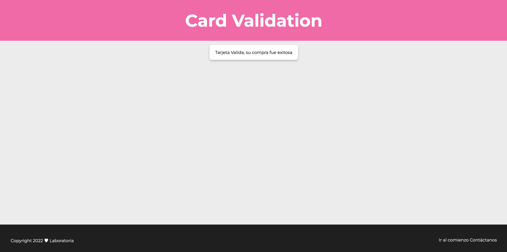

# Girl Power Card Validation project

## Índice

* [1. Proyecto](#1-proyecto)
* [2. Imagen final](#2-imagen-final)
* [3. Resumen del proyecto](#3-resumen-del-proyecto)
* [4. Primer prototipo](#4-primer-prototipo)
* [5. Mejoras](#5-mejoras)
* [6. Prototipo final](#6-prototipo-final)

***
## 1. Proyecto
Esta aplicación web fue creada para permitir a los usuarios registrar sus datos y su
tarjeta de crédito, de este modo validar dicha tarjeta para comprar de manera sencilla
y rápida la mejor proteína. Dale click para ver el proyecto:[card-validation] https://rossyalex.github.io/card-validation/

## 2. Imagen final

## 3. Resumen del proyecto
Esta aplicación web tiene como finalidad ofrecer la mejor proteína del mercado como lo
es Isolate a deportistas que no solo deseen prevenir el desgaste muscular, sino
también poder desarrollar los músculos, la cuál pueden comprar en una plataforma
amigable y fácil de manipular.

La proteína isolate o como se le conoce en español, aislada, tiene una concentración de
proteínas del 90 %, lo que hace que estimule la liberación de hormonas que aceleran el
metabolismo, por lo que favorece la quema de grasa y el aumento de masa muscular.
Esta proteína contiene todos los aminoácidos esenciales para nuestro cuerpo, se digiere
fácil y se absorbe más rápido que el resto de proteínas.

## 4. Primer prototipo

## 5. Mejoras

## 6. Prototipo final
En este enlace de [Figma](https://www.figma.com/proto/7Dx0y5MKog57HiwBLsrzaf/Card-Validation?node-id=4%3A6&starting-point-node-id=4%3A6) pueden acceder al prototipo final de la aplicación web.

